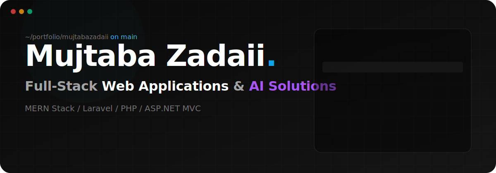
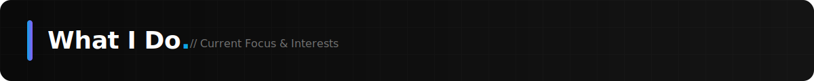
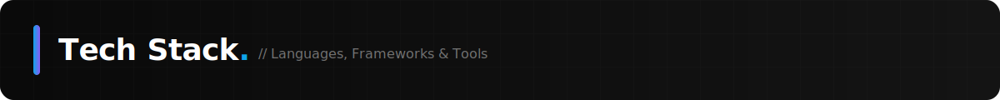
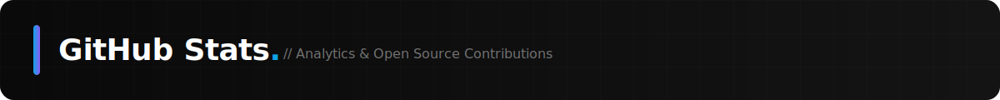

  

<table border="0" width="100%" style="background: transparent;">
  <tr>
    <td width="70%">
      <blockquote>
        <strong>Full-Stack Developer specializing in MERN, Laravel, and ASP.NET.</strong> I build highly responsive modern web applications, AI-powered solutions, and interactive 3D experiences.
      </blockquote>
      

        <a href="mailto:mujtabazadaii@gmail.com"><strong>Contact Me</strong></a> ·
        <a href="https://linkedin.com/in/mujtabazadaii"><strong>LinkedIn</strong></a> ·
        <a href="https://instagram.com/Mujtabazadaii"><strong>Instagram</strong></a>
      

    </td>
    <td width="30%" align="center">
      
    </td>
  </tr>
</table>

---

  

I enjoy understanding how systems work, optimizing their performance, and building secure software with modern technologies. Whether it's crafting a pixel-perfect frontend or architecting a robust relational database schema, I bring technical depth and a strong eye for design to every project.

- 🔭 **Currently working on:** Full-Stack Web Applications, AI-powered Solutions, and Interactive 3D Experiences
- 🌱 **Currently learning:** Artificial Intelligence, Large Language Models (LLMs), Cybersecurity, Cloud Computing, and System Design
- 👯 **Looking to collaborate on:** Open Source Projects, SaaS Platforms, AI Applications, and Modern Web Technologies
- 🤝 **Looking for help with:** Advanced AI/ML, Cloud Architecture, DevOps, and Offensive Security Research

  

| Frontend | Backend | Database | Tools & Others |
|----------|---------|----------|----------------|
| React, Next.js, Vue, Angular | Node.js, Express.js | MySQL, PostgreSQL | Git, GitHub, Vercel |
| TypeScript, JavaScript | PHP, Laravel | MongoDB | Netlify, Firebase, Supabase |
| Tailwind CSS, Bootstrap | ASP.NET MVC, C# | Microsoft SQL Server | WebGL, Three.js, GSAP |
| HTML5, CSS3, Astro | REST APIs | Oracle | Framer Motion, Windows Terminal |

  

  
  

  

### Top Contributed Repositories

  

 

  

