  

<table border="0" width="100%" style="background: transparent;">
  <tr>
    <td width="70%">
      <blockquote>
        <strong>Full-Stack Developer specializing in MERN, Laravel, and ASP.NET.</strong> I build highly responsive modern web applications, AI-powered solutions, and interactive 3D experiences.
      </blockquote>
      

        
        
        
      

    </td>
    <td width="30%" align="center">
      
    </td>
  </tr>
</table>

---

  

I enjoy understanding how systems work, optimizing their performance, and building secure software with modern technologies. Whether it's crafting a pixel-perfect frontend or architecting a robust relational database schema, I bring technical depth and a strong eye for design to every project.

- 🔭 **Currently working on:** Full-Stack Web Applications, AI-powered Solutions, and Interactive 3D Experiences
- 🌱 **Currently learning:** Artificial Intelligence, Large Language Models (LLMs), Cybersecurity, Cloud Computing, and System Design
- 👯 **Looking to collaborate on:** Open Source Projects, SaaS Platforms, AI Applications, and Modern Web Technologies
- 🤝 **Looking for help with:** Advanced AI/ML, Cloud Architecture, DevOps, and Offensive Security Research

  

  

  

  

  

  
  

  

 

