  

  🔭 I’m currently working on: Full-Stack Web Applications, AI-powered Solutions, and Interactive 3D Experiences  👯 I’m looking to collaborate on: Open Source Projects, SaaS Platforms, AI Applications, and Modern Web Technologies  🤝 I’m looking for help with: Advanced AI/ML, Cloud Architecture, DevOps, and Offensive Security Research  🌱 I’m currently learning: Artificial Intelligence, Large Language Models (LLMs), Cybersecurity, Cloud Computing, and System Design  💬 Ask me about: MERN Stack, React, Next.js, Node.js, Laravel, PHP, ASP.NET MVC, GSAP, Framer Motion, Three.js, REST APIs, SQL, MongoDB, and Software Architecture  ⚡ Fun fact: I enjoy understanding how systems work, optimizing their performance, and building secure software with modern technologies.

## 🌐 Socials:
   

# 💻 Tech Stack:
                                
# 📊 GitHub Stats:
 
 

### ✍️ Random Dev Quote

### 🔝 Top Contributed Repo

---

<!-- Proudly created with GPRM ( https://gprm.itsvg.in ) -->

  

